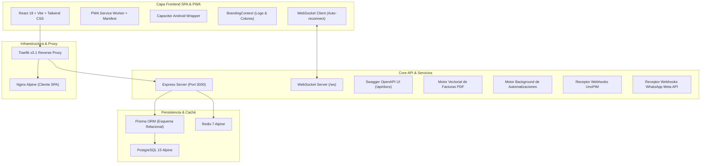

# 📋 Estado Completo del Proyecto DAMA-CRM

> **Fecha de Actualización:** Febrero 2026  
> **Versión:** 1.0.0 (Producción / Self-Hosted)  
> **Licencia:** MIT  
> **Autor:** Ignacio (`ignaciobrenas@gmail.com`)

---

## 🏗️ 1. Arquitectura del Sistema

---

## 📦 2. Modelos de Datos Implementados (`core/prisma/schema.prisma`)

1. **`User`**: Identidad de usuarios, email único, hash de contraseñas con bcrypt, flags de 2FA y estado activo.
2. **`Role`**: Roles dinámicos del sistema (`ADMIN`, `SALES`, `PROJECT_MANAGER`, `CLIENT`).
3. **`Permission`**: Permisos granulares de acceso por recurso y acción (`deals:read`, `invoices:write`, wildcard `*`).
4. **`TwoFactorToken`**: Tokens OTP temporales de 6 dígitos con caducidad para inicio de sesión seguro.
5. **`AuditLog`**: Registro forense inmutable de auditoría (quién, qué acción, IP, timestamp, payload anterior y nuevo).
6. **`Company`**: Empresas clientes con datos fiscales (NIF/CIF), ingresos anuales, plantilla y notas.
7. **`Contact`**: Contactos individuales vinculados a empresas, flags de leads, teléfonos, emails y cargos.
8. **`DealStage`**: Fases personalizables del embudo de ventas comercial (`Lead`, `Cualificación`, `Propuesta`, `Negociación`, `Cerrada Ganada`, `Cerrada Perdida`).
9. **`Deal`**: Oportunidades comerciales con valor económico, divisa, fecha prevista de cierre, probabilidad y estado.
10. **`Project`**: Proyectos vinculados a ventas cerradas o creados de forma independiente, con presupuesto y fechas.
11. **`Sprint`**: Sprints de desarrollo o entrega ágil con fechas de inicio/fin y objetivos.
12. **`Task`**: Tareas con estado (`TODO`, `IN_PROGRESS`, `DONE`), prioridad, estimación en horas y puntos de historia (Story Points).
13. **`Product`**: Catálogo de productos y servicios con precio base, código SKU y stock sincronizado.
14. **`Quote`**: Presupuestos formales a clientes con fecha de validez y cálculo de subtotales.
15. **`Invoice`**: Facturas emitidas con numeración correlativa (`FAC-2026-xxx`), fecha de vencimiento y estado de pago.
16. **`InvoiceItem`**: Líneas de factura con descripción, unidades, precio unitario y tipo de IVA (21%).
17. **`Workflow` & `WorkflowLog`**: Definición de reglas automáticas de negocio y su historial de ejecuciones.
18. **`OmniMessage`**: Mensajería omnicanal unificada (WhatsApp Meta API y Correo Electrónico).
19. **`Activity`**: Registro interactivo de interacciones comerciales (**Llamadas, Reuniones, Notas, Tareas**) con duración y estado de completitud.
20. **`CustomField` & `CustomFieldValue`**: Motor dinámico de campos personalizados de cualquier tipo (`TEXT`, `NUMBER`, `DATE`, `SELECT`, `BOOLEAN`) para cualquier entidad sin alterar el esquema SQL físico.

---

## 🌐 3. Endpoints de la API Backend

Todos los endpoints están protegidos por middleware JWT y control dinámico RBAC:

* **Autenticación & Seguridad:**
  - `POST /api/auth/login` (Inicio de sesión con validación de contraseña y detección de 2FA)
  - `POST /api/auth/verify-2fa` (Validación de código OTP de 6 dígitos)
  - `PATCH /api/auth/2fa/toggle` (Activación/Desactivación de 2FA)
  - `GET /api/auth/me` (Datos del usuario autenticado)
* **Ventas & Pipeline:**
  - `GET /api/deals/pipeline` (Métricas de embudo y listado ordenado por fases)
  - `POST /api/deals` (Creación de oportunidades)
  - `PATCH /api/deals/:id` (Mutación optimizada para Drag & Drop en Kanban con broadcast WebSocket)
  - `DELETE /api/deals/:id` (Eliminación)
* **Gestión Ágil de Proyectos:**
  - `GET /api/projects` (Listado de proyectos y cálculo de progreso)
  - `POST /api/projects` (Nuevo proyecto)
  - `POST /api/projects/sprints` (Nuevo sprint)
  - `POST /api/projects/tasks` (Nueva tarea)
  - `PATCH /api/projects/tasks/:id` (Actualización de estado o asignación de tarea)
* **Directorio CRM:**
  - `GET /api/contacts` / `POST /api/contacts` / `GET /api/contacts/:id`
  - `GET /api/companies` / `POST /api/companies` / `GET /api/companies/:id`
* **Timeline de Actividades:**
  - `GET /api/activities?contactId=xxx&dealId=xxx` (Listado cronológico)
  - `POST /api/activities` (Creación de llamada, reunión, nota o tarea)
  - `PATCH /api/activities/:id` (Marcar completada o pendiente)
* **Campos Personalizados (Metadata Engine):**
  - `GET /api/custom-fields?entity=CONTACT|DEAL` (Definiciones de campos)
  - `POST /api/custom-fields` (Crear nuevo campo)
  - `GET /api/custom-fields/entity/:entityId` (Valores actuales)
  - `POST /api/custom-fields/entity/:entityId` (Guardado masivo de valores)
* **Facturación & PDF:**
  - `GET /api/invoices` / `POST /api/invoices`
  - `GET /api/invoices/:id/pdf` (Descarga directa de PDF vectorial generado al vuelo con PDFKit)
* **Inventario & UnoPIM:**
  - `POST /api/inventory/webhooks/unopim` (Webhook de sincronización en vivo)
  - `POST /api/inventory/sync-now` (Ejecución forzada de reconciliación)
* **Omnicanal & WhatsApp:**
  - `GET /api/omnichannel/webhooks/whatsapp` (Handshake de validación Meta)
  - `POST /api/omnichannel/webhooks/whatsapp` (Recepción de mensajes y broadcast WS)
  - `POST /api/omnichannel/messages` (Envío de mensajes con broadcast WS)
* **Business Intelligence & Informes:**
  - `GET /api/reports/kpis` (Métricas de ventas, conversión y velocidad)
  - `GET /api/reports/export/deals` (Exportación directa a CSV estructurado)
* **Buscador Global:**
  - `GET /api/search?q=texto` (Búsqueda unificada en contactos, empresas, ventas, proyectos y facturas)
* **Documentación & Salud:**
  - `GET /api/health` (Healthcheck para Traefik y Docker)
  - `GET /api/docs` (Swagger UI interactivo OpenAPI 3.0)
  - `GET /api/docs/json` (Especificación JSON OpenAPI)

---

## 🎨 4. Interfaz de Usuario y Vistas Frontend

* **Diseño Global con Bordes Redondeados:**
  - Estilo redondeado configurado en `client/src/index.css` e inyectado con variables dinámicas (`--custom-radius`).
  - Tarjetas, botones, inputs, diálogos, selectores y tablas con bordes redondeados modernos.
* **Sistema de Personalización de Marca (White-label Branding):**
  - Configuración en la vista de Ajustes (`Settings.tsx`).
  - Sube tu logo corporativo (URL o archivo de imagen local) o usa el isotipo por defecto.
  - Elige el nombre de la empresa y el color primario corporativo (HEX o paleta predefinida).
  - Selecciona la curvatura de bordes (8px, 14px, 20px, 28px).
  - Vista previa en tiempo real y persistencia en `localStorage`.
* **Tiempo Real con WebSockets (`wsClient`):**
  - Conexión persistente y reconexión automática en segundo plano.
  - Actualizaciones en vivo del pipeline Kanban al mover o crear oportunidades.
  - Actualizaciones en vivo del chat omnicanal de WhatsApp.
  - Notificaciones en vivo con contador pulsante en el Navbar.
* **Manejo de Errores Amigable:**
  - En `client/src/services/api.ts`, los errores técnicos o de base de datos se traducen a mensajes sencillos y seguros para el usuario final.
* **10 Idiomas con Soporte RTL:**
  - Español, Inglés, Francés, Alemán, Portugués, Italiano, Chino, Japonés, Ruso y Árabe (con layout dinámico `dir="rtl"`).
* **Paleta de Comandos Global (`Cmd+K` / `Ctrl+K`):**
  - Navegación instantánea por teclado y búsqueda de entidades.
* **Modo Oscuro / Claro:**
  - Detección automática del sistema operativo y alternancia manual persistente.

---

## 🛡️ 5. Seguridad y Gobernanza

* **Protección de Ramas en Git:**
  - Flujo de trabajo basado estrictamente en ramas (`feature/*`).
  - Merge a `master` con `--no-ff`.
  - Workflow [.github/workflows/block-main-push.yml](.github/workflows/block-main-push.yml) para impedir pushes directos.
* **Auditoría de Seguridad y Calidad:**
  - [.github/workflows/audit-security.yml](.github/workflows/audit-security.yml) (`npm audit`, escaneo de secretos).
  - [.github/workflows/lint-and-typecheck.yml](.github/workflows/lint-and-typecheck.yml) (Verificación de TypeScript, build y tests).
  - [.github/workflows/docker-build-check.yml](.github/workflows/docker-build-check.yml) (Comprobación de construcción de contenedores).
* **Copias de Seguridad Automatizadas:**
  - Scripts [scripts/backup-db.sh](scripts/backup-db.sh) y [scripts/backup-db.ps1](scripts/backup-db.ps1) para volcados gzip de PostgreSQL.
  - Script [scripts/restore-db.sh](scripts/restore-db.sh) para recuperación ante desastres.

---

## 📱 6. PWA y Documentación

* **PWA:**
  - [client/public/manifest.json](client/public/manifest.json)
  - [client/public/sw.js](client/public/sw.js)
  - [client/public/favicon.svg](client/public/favicon.svg)
* **Capacitor Android:**
  - [client/capacitor.config.ts](client/capacitor.config.ts)
* **Portal de Documentación Docusaurus:**
  - Ubicado en `docs/` con guías de despliegue a coste cero, arquitectura y API.
* **Instaladores en Un Clic:**
  - [install.sh](install.sh) (Linux/macOS) y [install.ps1](install.ps1) (Windows PowerShell).

---

## 🧪 7. Suite de Tests Automatizados (`core/tests/`)

* **16 tests implementados con el test runner nativo de Node.js:**
  - `core/tests/unit.test.ts`: Hashes bcrypt, firma y verificación JWT, matriz de roles RBAC, redondeos fiscales de facturas e IVA, validación de tipos de campos dinámicos.
  - `core/tests/integration.test.ts`: Parser de webhooks de inventario UnoPIM, handshake y normalización de Meta WhatsApp Cloud, evaluador de disparadores de workflows.
  - Ejecutables con: `npm test` o `npm run test` desde la raíz.
