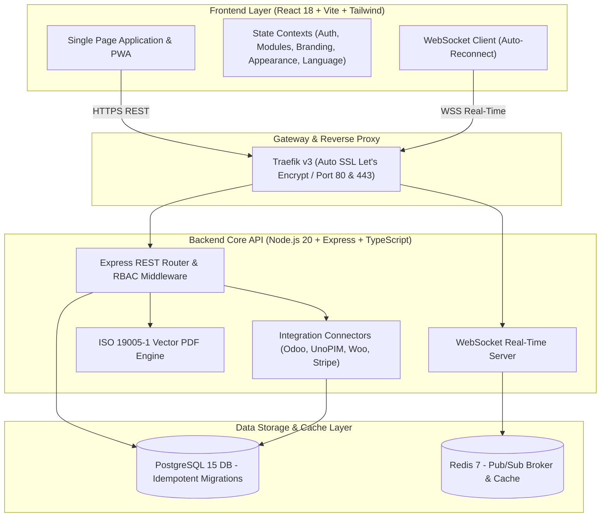

# DAMA-CRM: Plataforma Integral Open-Source y Self-Hosted para PYMES 🚀

<div align="center">

<picture>
  <source media="(prefers-color-scheme: dark)" srcset="client/public/assets/logos/dama-logo-white.svg">
  <source media="(prefers-color-scheme: light)" srcset="client/public/assets/logos/dama-logo-dark.svg">
  
</picture>

<p align="center">
  <strong>CRM empresarial modular de alto rendimiento: Gestión comercial, Portal del Empleado, Facturación ISO 19005-1, Mesa de Ayuda con SLAs, Automatizaciones y Centro de Integraciones ERP / E-Commerce.</strong><br>
  <em>100% On-Premise y Self-Hosted • Zero Licencias Recurrentes • Multi-Tenant • 10 Idiomas • Arquitectura React 18 + Node.js 20 + PostgreSQL + Redis</em>
</p>

[](LICENSE)
[](docker-compose.yml)
[](https://nodejs.org/)
[](https://www.typescriptlang.org/)
[](https://www.postgresql.org/)
[](https://redis.io/)
[](https://react.dev/)
[](https://tailwindcss.com/)
[](core/src/services/websocket.service.ts)
[](client/src/i18n)

</div>

---

## 🌟 Listado Completo de Funcionalidades del CRM

DAMA-CRM está diseñado como un ecosistema modular integral donde cada empresa u organización puede activar o desactivar módulos en función de su operativa diaria:

```
┌────────────────────────────────────────────────────────────────────────────────────────┐
│                                   DAMA-CRM ECOSYSTEM                                   │
├──────────────────────────┬──────────────────────────┬──────────────────────────────────┤
│ 👑 God Mode SuperAdmin   │ 👥 Portal del Empleado   │ 📑 Facturación ISO 19005-1       │
│ 🏢 Multi-Tenant SaaS     │ ⏱️ Fichajes & Control    │ ✍️ Firma Digital de Presupuestos │
│ ⚙️ Gestor de 15 Módulos  │ 💰 Nóminas & Privacidad  │ 📊 Margen P&L y Modelo 303 AEAT  │
├──────────────────────────┼──────────────────────────┼──────────────────────────────────┤
│ 🎯 Pipeline Comercial    │ 🎫 Mesa de Ayuda (SLA)   │ 💬 WhatsApp Omnicanal con IA     │
│ 📋 Proyectos & Sprints   │ 📦 Inventario & UnoPIM   │ 🔌 Hub Conectores (Odoo/Woo/n8n) │
├──────────────────────────┼──────────────────────────┼──────────────────────────────────┤
│ 🔔 WebSocket Real-Time   │ 🔒 2FA OTP & Matriz RBAC │ 🎨 Zoom UI, Accesibilidad & i18n │
└──────────────────────────┴──────────────────────────┴──────────────────────────────────┘
```

### 1. 🏢 Multi-Tenant SaaS & Modo Dios (SuperAdmin God Mode)
* **Aislamiento Multi-Empresa Estricto:** Separación de datos, usuarios, contactos y facturación por `tenantId`.
* **Conmutador de Empresa en 1 Clic (God Mode):** Los administradores globales pueden supervisar y alternar entre cualquier empresa del sistema sin cerrar sesión.
* **Gobierno de Cuentas Jerárquico:** Solo los administradores de empresa pueden crear usuarios de su propia organización; el SuperAdmin puede dar de alta usuarios y asignarlos libremente a cualquier empresa.

### 2. ⚙️ Gestor Modular y Activación de Funcionalidades
* **15 Módulos Conmutables:** Activa o desactiva funcionalidades a nivel de empresa desde `Configuración > Módulos` (`portalEmpleado`, `tickets`, `expenses`, `pipeline`, `agile`, `invoicing`, `inventory`, `workflows`, `omnichannel`, `integrations`, `leadCapture`, `reports`, `clientPortal`, `contacts`, `companies`).
* **Barreras de Permisos Dinámicas (`PermissionGate` y `ModuleDisabled`):** Bloqueo visual y por API con mensaje explicativo amigable si un módulo está deshabilitado.
* **Copia de Seguridad y Diagnóstico del Sistema:** Exportación en 1 clic de backups completos en JSON (`GET /api/modules/export-backup`) y diagnóstico de salud del clúster Docker/Postgres (`GET /api/modules/system-status`).

### 3. 👥 Portal del Empleado & Control Horario Legal
* **Registro de Jornada en 1 Clic:** Fichaje directo de Entrada / Salida desde la barra superior de navegación y vista completa en `/portal-empleado`.
* **Cumplimiento Legal (Estatuto de los Trabajadores):** Justificación obligatoria y selección de motivos (Jornada ordinaria, Teletrabajo, Visita a cliente, Horas extra, Pausa médica).
* **Integración Bidireccional Odoo `hr.attendance`:** Sincronización automática de fichajes hacia el ERP Odoo.
* **Gestión Confidencial de Nóminas:** Consulta individual de nóminas oficiales en PDF con enmascaramiento estricto de datos salariales entre empleados (Cumplimiento RGPD).

### 4. 🎯 Pipeline Comercial Kanban & Previsión de Ingresos
* **Tablero Visual Interactivo:** Gestión de tratos por etapas arrastrables (*Lead*, *Contacto*, *Propuesta*, *Negociación*, *Ganado*, *Perdido*).
* **Cálculo Ponderado de Ventas:** Previsión automática de ingresos según el porcentaje de éxito de cada etapa comercial.
* **Conversión en 1 Clic:** Convierte un trato ganado en factura oficial o proyecto ágil inmediatamente.

### 5. 📋 Proyectos Ágiles, Planner & Sprints
* **Tableros Scrum / Kanban:** Gestión de sprints, historias de usuario, asignación de responsables y seguimiento de backlog.
* **Estimación y Carga de Trabajo:** Puntos de historia, fechas límite y diagrama visual del estado de entregables.

### 6. 📑 Facturación Conforme a Normativa & Presupuestos con Firma Digital
* **Motor PDF Vectorial ISO 19005-1 (PDF/A):** Generación de facturas y presupuestos con maquetación tipográfica exacta, paginación dinámica, desglose fiscal de IVA y marca corporativa.
* **Aceptación y Firma Digital del Cliente (`/quote/sign/:token`):** Portal público seguro para que los clientes rubriquen presupuestos desde cualquier dispositivo (móvil/pantalla táctil) sin necesidad de credenciales.
* **Exportación Contable Oficial:** Libros de facturas emitidas y recibidas compatibles con requerimientos de la AEAT.

### 7. 💰 Control de Gastos, Margen P&L y Liquidación de Impuestos
* **Libro de Facturas Recibidas:** Registro de gastos por proveedor, NIF/CIF, categoría y forma de pago.
* **Cálculo de Margen Operativo Real:** Ingresos cobrados vs Gastos pagados con cálculo automático de IVA Repercutido vs Soportado Deducible (Modelo 303).
* **Informe de Antigüedad de Deuda (Aging / Dunning):** Clasificación de cobros pendientes en tramos (0-30 días, 31-60 días, 61-90 días, +90 días).

### 8. 🎫 Mesa de Ayuda (Tickets) & Monitor de SLAs
* **Centro de Soporte Técnico:** Gestión de incidencias con cálculo automatizado de tiempo restante y vencimiento de SLA según prioridad (Urgente, Alta, Media, Baja).
* **Notas Internas Confidenciales vs Respuestas Públicas:** Hilos de mensajería con separación clara entre notas privadas para agentes y respuestas visibles para el cliente.

### 9. 📦 Gestión de Inventario & Sincronización UnoPIM
* **Catálogo de Productos y SKUs:** Control de stock mínimo, stock disponible, precio de coste y precio de venta.
* **Webhooks de Sincronización UnoPIM:** Actualización de catálogo y stock en tiempo real mediante `POST /api/integrations/unopim/webhook`.

### 10. 💬 Bandeja Omnicanal WhatsApp & Respuestas con IA
* **Meta WhatsApp Cloud API Oficial:** Envío y recepción de mensajes con normalización de números E.164.
* **Respuestas Contextuales con IA:** Asistencia inteligente para sugerir respuestas comerciales y soporte al instante.

### 11. 🔌 Hub de Integraciones de Terceros
* **Conectores Nativos Verificados:** Conexión con **Odoo**, **UnoPIM**, **WooCommerce**, **Shopify**, **n8n**, **Stripe**, **Zapier** y servidores de correo **SMTP**.
* **Comprobación de Conectividad en Vivo:** Diagnóstico inmediato de credenciales API y tokens desde la interfaz gráfica.

### 12. 🔔 Centro de Notificaciones en Tiempo Real por WebSocket
* **Alertas Interactivas y Redirección Directa:** Cada notificación incluye su URL de destino (`actionUrl`), permitiendo al usuario navegar con 1 clic al ticket, factura, trato o fichaje correspondiente.
* **Bandeja de Pendientes y No Leídas:** Indicadores numéricos en vivo, marcado de leídas y blindaje para alto volumen de eventos.

### 13. 🔒 Seguridad Corporativa, 2FA OTP & Matriz RBAC Dinámica
* **Autenticación en Dos Pasos (2FA OTP):** Códigos temporales enviados al correo del usuario con protección contra ataques de fuerza bruta.
* **Matriz de Permisos RBAC Dinámica:** Control granular por recurso (`deals`, `invoices`, `contacts`, `tickets`, `expenses`, `users`, `employees`) y acción (`create`, `read`, `update`, `delete`).
* **Auditoría de Seguridad Inmutable:** Registro de accesos fallidos, exportaciones de datos y cambios de configuración.

### 14. 🌍 Internacionalización Completa (10 Idiomas Oficiales)
* **Soporte Global:** Español (`es`), Inglés (`en`), Francés (`fr`), Alemán (`de`), Italiano (`it`), Portugués (`pt`), Árabe RTL (`ar`), Chino Simplificado (`zh`), Japonés (`ja`) y Ruso (`ru`).
* **Zero Strings Hardcodeados:** 100% de la interfaz, modales, tablas y notificaciones utilizan claves de traducción estructuradas.

### 15. 🎨 Accesibilidad, Escalado UI Zoom y Tipografía Persistente
* **Ajuste Global de Escala (Zoom UI):** Escalado dinámico desde 80% (Compacto) hasta 125% (Accesibilidad ampliada).
* **Tamaño de Fuente Tipográfica:** Modificación en tiempo real del tamaño de fuente en toda la aplicación.
* **Biblioteca de Iconos Dinámicos:** Iconos con micro-animaciones fluidas (`framer-motion`), sólidos clásicos o minimalistas.
* **Persistencia en Base de Datos:** Todas las preferencias visuales y de accesibilidad se guardan permanentemente en el perfil del usuario en PostgreSQL.

---

## 📸 Galería Visual y Capturas Reales

### 1. Panel de Control y Métricas BI (Dashboard)
Visualiza KPIs de facturación, tasa de conversión, actividad del pipeline comercial y gráficos interactivos con transiciones fluidas.

| Modo Claro (Light Mode) | Modo Oscuro (Dark Mode) |
| :---: | :---: |
|  |  |

---

### 2. Hub de Integraciones de Terceros (`/integrations`)
Catálogo integral con filtrado por categorías (ERP, E-Commerce, Automatización, Pasarelas de Pago, Comunicación), buscador en tiempo real, comprobación de conexión en vivo y panel de credenciales con control estricto para administradores.

| Integraciones en Modo Claro | Integraciones en Modo Oscuro |
| :---: | :---: |
|  |  |

---

### 3. Asistente de Onboarding Guiado (`/onboarding`) y Acceso Seguro
Experiencia de bienvenida con selección de permisos por rol, micro-animaciones, opción de omitir configuración y personalización de marca.

| Asistente de Onboarding | Pantalla de Acceso & Autenticación |
| :---: | :---: |
|  |  |

---

## 🏗️ Arquitectura Técnica del Sistema



---

## ⚡ Inicio Rápido en Desarrollo Local

### Requisitos Previos
* **Node.js:** v20.x o v24.x
* **npm:** v10.x o superior
* **Docker Desktop** (para PostgreSQL y Redis) o PostgreSQL 15 local

### Comandos de Puesta en Marcha

```bash
# 1. Clonar el repositorio
git clone https://github.com/Ignaciobrenas/DAMA-CRM.git
cd DAMA-CRM

# 2. Instalar dependencias globales y de cada paquete
npm install
npm --prefix core install
npm --prefix client install

# 3. Configurar variables de entorno iniciales
cp .env.example .env

# 4. Levantar la base de datos PostgreSQL y Redis con Docker
docker compose up -d crm-db crm-redis

# 5. Aplicar migraciones idempotentes y cargar datos demo iniciales (Seed)
npm run db:setup:pg

# 6. Iniciar entorno de desarrollo concurrente
npm run dev
```

### URLs del Entorno Local
* 🟢 **Frontend Web (Vite SPA + PWA):** [http://localhost:5173](http://localhost:5173)
* 🔵 **API Backend Core (Express + WebSockets):** [http://localhost:4000](http://localhost:4000)
* ⚡ **Canal WebSocket en tiempo real:** `ws://localhost:4000/ws`
* 📖 **Documentación Swagger OpenAPI 3.0 interactiva:** [http://localhost:4000/api/docs](http://localhost:4000/api/docs)
* 🗄️ **Base de datos PostgreSQL:** `localhost:5433` (mapeada en el contenedor `dama-crm-db`)
* 🔴 **Broker Redis:** `localhost:6379` (en el contenedor `dama-crm-redis`)

---

## 👥 Credenciales de Acceso Demo

| Perfil / Rol | Correo Electrónico | Contraseña | Permisos y Alcance |
| :--- | :--- | :--- | :--- |
| **Super Administrador (God Mode)** | `ignaciobrenas@gmail.com` | `1` | Acceso universal (`*`), conmutador de empresas, RBAC dinámico, activación de módulos |
| **Administrador de Empresa** | `admin@dama-crm.local` | `Admin1234!` | Acceso completo a su empresa, gestión de miembros, facturación y marca blanca |
| **Comercial / Ventas** | `ventas@dama-crm.local` | `Ventas1234!` | Contactos, pipeline comercial, presupuestos, firma digital y WhatsApp |
| **Equipo Técnico / Proyectos** | `pm@dama-crm.local` | `Pm1234!` | Proyectos ágiles, sprints, tickets de soporte y fichaje de jornada |
| **Empleado / Colaborador** | `empleado@dama-crm.local` | `Empleado1234!` | Portal del Empleado, fichajes legales con motivo y consulta de nóminas |

---

## 🚀 Guía de Despliegue en Servidor de Producción (VPS / Cloud)

### 1. Preparación del Servidor Linux (Ubuntu 22.04 / 24.04 o Debian 12)
```bash
sudo apt update && sudo apt upgrade -y
sudo apt install -y docker.io docker-compose-plugin git curl
sudo systemctl enable --now docker
```

### 2. Clonar el Proyecto y Configurar `.env`
```bash
git clone https://github.com/Ignaciobrenas/DAMA-CRM.git /opt/dama-crm
cd /opt/dama-crm
cp .env.example .env
nano .env
```

### 3. Despliegue con Docker Compose
```bash
# Construir y levantar todos los contenedores en segundo plano
docker compose -f docker-compose.prod.yml up -d --build

# Verificar el estado de los contenedores
docker compose ps
```

---

## 🛠️ Ejemplos de Uso de la API & Endpoints Principales

### 1. Fichaje de Jornada con Motivo Legal (`POST /api/employees/clock-in`)
```bash
curl -X POST http://localhost:4000/api/employees/clock-in \
  -H "Authorization: Bearer <TOKEN>" \
  -H "Content-Type: application/json" \
  -d '{
    "reason": "Jornada ordinaria en oficina",
    "location": "Sede Central - Madrid"
  }'
```

### 2. Generación de Factura en PDF ISO 19005-1 (`GET /api/invoicing/:id/pdf`)
```bash
curl -X GET http://localhost:4000/api/invoicing/inv-12345/pdf \
  -H "Authorization: Bearer <TOKEN>" \
  --output Factura_Oficial.pdf
```

### 3. Aceptación y Firma Digital de Presupuesto (`POST /api/invoicing/quotes/sign/:token`)
```bash
curl -X POST http://localhost:4000/api/invoicing/quotes/sign/token-abc-123 \
  -H "Content-Type: application/json" \
  -d '{
    "signerName": "Juan Pérez",
    "signatureData": "data:image/png;base64,iVBORw0KGgoAAAANSUhEUgAA...",
    "legalConsent": true
  }'
```

### 4. Actualización de Activación de Módulos (`PUT /api/modules/toggle`)
```bash
curl -X PUT http://localhost:4000/api/modules/toggle \
  -H "Authorization: Bearer <TOKEN>" \
  -H "Content-Type: application/json" \
  -d '{
    "moduleKey": "tickets",
    "enabled": true
  }'
```

### 5. Exportación de Backup JSON del Sistema (`GET /api/modules/export-backup`)
```bash
curl -X GET http://localhost:4000/api/modules/export-backup \
  -H "Authorization: Bearer <TOKEN>" \
  --output backup-dama-crm.json
```

---

## 🧪 Ejecución de Pruebas Unitarias y de Integración

```bash
# Ejecutar suite de pruebas en el backend core (66 suites con 100% de éxito)
npm --prefix core test

# Verificar tipos y compilación del frontend React
npm --prefix client run build
```

---

## 📄 Licencia

Este proyecto está licenciado bajo la **Licencia MIT**. Eres libre de usarlo, modificarlo y distribuirlo para uso privado o comercial sin ningún coste de licencia recurrente.
