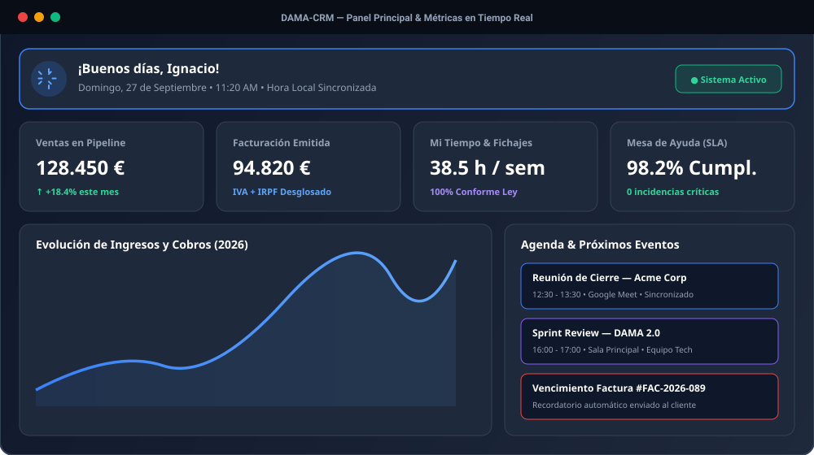
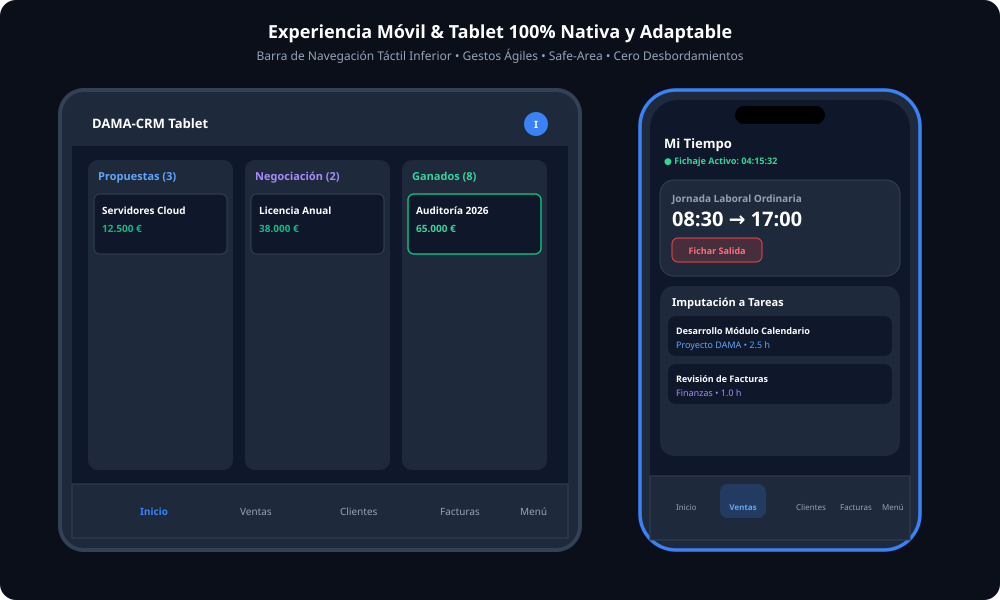
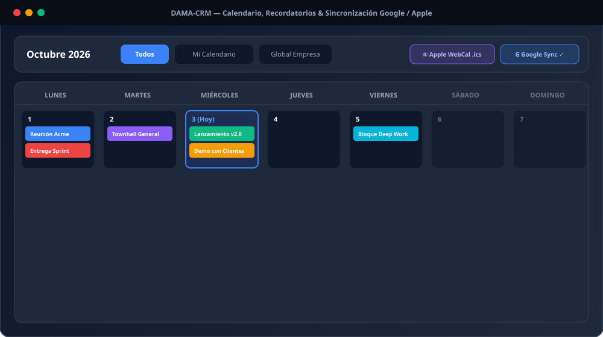
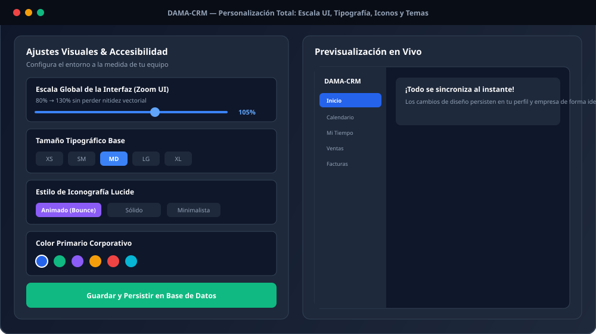

# DAMA-CRM: Plataforma Integral Modular para PYMES & Empresas 🚀

<div align="center">

<picture>
  <source media="(prefers-color-scheme: dark)" srcset="client/public/assets/logos/dama-logo-white.svg">
  <source media="(prefers-color-scheme: light)" srcset="client/public/assets/logos/dama-logo-dark.svg">
  
</picture>

<p align="center">
  <strong>CRM &amp; ERP Modular de Alto Rendimiento: Gestión Comercial, Catálogo &amp; Inventario con Mapeo Multi-App, Calendario con Sincronización Google / Apple, Portal del Empleado &amp; Mi Tiempo, Facturación Legal ISO 19005-1, Mesa de Ayuda con SLAs y Conectores Sage / Odoo / UnoPIM / OpenCart / Shopify.</strong><br>
  <em>100% Self-Hosted • Zero Licencias Recurrentes • Multi-Tenant Real • 11 Idiomas • Multiplataforma (Web, Escritorio Electron, Móvil Capacitor Android/iOS)</em>
</p>

[](LICENSE)
[](docker-compose.yml)
[](https://nodejs.org/)
[](https://www.typescriptlang.org/)
[](https://www.postgresql.org/)
[](https://redis.io/)
[](https://react.dev/)
[](https://tailwindcss.com/)
[](server/tests)
[](client/src/i18n)

</div>

---

## 📸 Vista Previa de la Plataforma

<div align="center">
  
</div>

---

## 📱 Experiencia Responsive & Multiplataforma (Web, Escritorio y Móvil)

DAMA-CRM está diseñado con una arquitectura **Mobile-First y Multiplataforma real**:

<div align="center">
  
</div>

* **Barra de Navegación Inferior Táctil:** Acceso instantáneo con el pulgar a *Inicio*, *Ventas*, *Clientes*, *Facturas* y *Menú Global*.
* **Popups y Modales Centrados:** Selector de idiomas con buscador interactivo, centro de notificaciones en tiempo real y Command Palette (Ctrl+K) perfectamente centrados en pantalla con diseño premium y animaciones suaves.
* **Áreas Seguras (Safe-Area Insets):** Integración nativa con los bordes curvos de dispositivos iOS y Android.
* **Ecosistema Multiplataforma Distribuido:**
  - **Escritorio:** Paquete nativo Electron para Windows (.exe), Linux (.deb/AppImage) y macOS (.dmg) vía `proyecto-contenedor-escritorio`.
  - **Móvil:** Paquete nativo Capacitor para Android (.apk/.aab) e iOS vía `proyecto-contenedor-movil`.

---

## 🌟 Ecosistema de Módulos Disponibles

Cada empresa puede activar o desactivar dinámicamente los módulos según sus necesidades operativas desde `Configuración > Módulos`:

```text
┌────────────────────────────────────────────────────────────────────────────────────────┐
│                                   DAMA-CRM ECOSYSTEM                                   │
├──────────────────────────┬──────────────────────────┬──────────────────────────────────┤
│ 👑 God Mode SuperAdmin   │ 📅 Calendario & Alertas  │ 📑 Facturación ISO 19005-1       │
│ 🏢 Multi-Tenant SaaS     │ 👥 Portal del Empleado   │ ✍️ Firma Digital de Presupuestos │
│ ⚙️ Gestor de Módulos     │ ⏱️ Mi Tiempo & Fichajes  │ 📊 Margen P&L y Modelo 303 AEAT  │
├──────────────────────────┼──────────────────────────┼──────────────────────────────────┤
│ 🎯 Ventas & Pipeline     │ 🎫 Mesa de Ayuda (SLA)   │ 💬 WhatsApp Omnicanal con IA     │
│ 📋 Proyectos & Sprints   │ 📦 Catálogo & Cajas Dual │ 🔌 Conectores Sage / Odoo / n8n  │
├──────────────────────────┼──────────────────────────┼──────────────────────────────────┤
│ 🔔 WebSocket Real-Time   │ 🔒 2FA OTP & Matriz RBAC │ 🎨 Personalización & Zoom UI     │
└──────────────────────────┴──────────────────────────┴──────────────────────────────────┘
```

---

### 1. 📦 Inventario Inteligente: Vista Dual (Tabla / Cajas) & Auto-Mapeo Multi-App

* **Vista Dual Conmutable:** Alterna al instante entre vista de **Tabla compacta** y vista de **Cajas visuales** con fotos en alta resolución, indicador de stock con barra de progreso cromática (verde/naranja/rojo), márgenes de beneficio y precios de compra/venta.
* **Mapeo Automático de Atributos & Metadatos:** Motor inteligente que mapea automáticamente especificaciones técnicas, variantes y atributos con conectores:
  - **UnoPIM:** Atributos PIM, familias y variantes.
  - **OpenCart:** Opciones de producto, atributos y categorías de tienda.
  - **Sage ERP (Sage 1, 50 y 200):** Cuentas contables, referencias de proveedor y tarifas.
  - **Odoo:** Plantillas de productos y variantes de inventario.
  - **Shopify & WooCommerce:** Metacampos, tags y variantes de eCommerce.
* **Auto-Mapeo en Lote:** Botón de sincronización masiva para actualizar y normalizar atributos en todo el catálogo en un solo clic.

---

### 2. 📅 Calendario, Recordatorios y Sincronización Google / Apple

<div align="center">
  
</div>

* **Vistas Múltiples:** Visualización mensual, semanal, diaria y lista de agenda cronológica.
* **Separación de Calendarios:** Calendario personal privado y calendario global corporativo para hitos compartidos y entregas de proyectos.
* **Sincronización Apple Calendar:** Enlace `webcal://` y suscripción `.ics` en tiempo real para iPhone, iPad y Mac.
* **Sincronización Google Calendar:** Integración bidireccional de citas, reuniones comerciales y enlaces Google Meet.
* **Sistema de Alertas y Recordatorios:** Avisos flotantes configurables (15m, 1h, 1 día antes) con descarte en 1 clic y sonido armónico.

---

### 3. 📑 Suite de Facturación Avanzada, Rectificativas e IRPF

<div align="center">
  
</div>

* **Descuentos e Impuestos Flexibles:** Descuento por línea, descuento global sobre la base imponible y retenciones de IRPF profesional (0%, 7%, 15%, 19%).
* **Facturas Rectificativas (Abonos):** Emisión legal de facturas rectificativas vinculadas a la factura original con selección de motivos reglamentarios (R1 a R5) e importes negativos automáticos.
* **Facturas Proforma y Presupuestos:** Conversión de presupuestos en facturas en 1 solo clic.
* **Firma Digital Pública (`/quote/sign/:token`):** Aceptación y rúbrica táctil directa del cliente sin necesidad de registro ni contraseñas.
* **Plazos de Vencimiento:** Presets estándar (*Inmediato*, *15 días*, *30 días*, *60 días*, *Fin de mes*).

---

### 4. 🎯 Ventas (Pipeline Kanban Comercial)

* **Embudo Visual de Ventas:** Etapas personalizables (*Lead*, *Contacto*, *Propuesta*, *Negociación*, *Ganado*, *Perdido*).
* **Previsión Ponderada de Ingresos:** Cálculo dinámico de ingresos según la probabilidad de éxito de cada etapa comercial.
* **Trazabilidad Completa:** Vinculación directa entre contactos, empresas, ofertas, presupuestos y proyectos.

---

### 5. ⏱️ Mi Tiempo & Portal del Empleado

* **Control Horario Legal (Estatuto de los Trabajadores):** Fichaje digital con justificación de jornada (Oficina central, Teletrabajo, Visita comercial, Pausa médica).
* **Imputación de Horas a Tareas:** Registro detallado de minutos dedicados a cada proyecto para control de rentabilidad y desvíos.
* **Nóminas y Privacidad (RGPD):** Consulta privada de nóminas en PDF con enmascaramiento estricto de datos bancarios entre compañeros.
* **Sincronización Odoo:** Integración nativa con `hr.attendance`.

---

### 6. 📋 Planificador Ágil & Proyectos

* **Scrum & Kanban Integrados:** Sprints, historias de usuario, estimación de puntos y asignación de responsables.
* **Detalle Enriquecido en Markdown:** Descripciones técnicas con soporte para código, listas y adjunto de imágenes con vista previa.
* **Hilo de Comentarios y Tiempos:** Conversaciones en tiempo real y registro de horas invertidas por tarea.

---

### 7. 🎨 Personalización Total y Persistencia en BBDD

<div align="center">
  
</div>

* **Zoom UI / Escala Global de la Interfaz:** Selector de escala fluida (80% a 130%) para monitores grandes o portátiles compactos.
* **Tamaños Tipográficos Base:** XS, SM, MD, LG, XL adaptados a cualquier necesidad visual.
* **Estilos de Iconos Lucide:** Alterna entre iconos animados (*Bounce*), sólidos o minimalistas con previsualización en vivo.
* **Colores de Marca e Identidad:** Selector de paleta corporativa y subida de logotipos persistentes por empresa.

---

### 8. 🔌 Conectores e Integraciones ERP

* **Sage ERP:** Conectores oficiales estructurados para **Sage 1 (Business Cloud)**, **Sage 50** y **Sage 200**.
* **OpenCart:** Sincronización de catálogo, pedidos y stock.
* **UnoPIM:** Sincronización bidireccional de catálogo, variantes, precios y control de stock.
* **WooCommerce & Shopify:** Captura de pedidos en tiempo real convirtiéndolos en tratos y contactos del CRM.
* **Meta WhatsApp Cloud API:** Bandeja omnicanal con asistencia de respuestas automáticas con IA.
* **n8n / Zapier / Webhooks:** Automatizaciones libres y triggers de eventos.

---

### 9. 🌐 Soporte Multi-Idioma Completo (11 Idiomas)

DAMA-CRM cuenta con traducción completa y sincronizada (100% de paridad) en 11 idiomas:
- 🇪🇸 Español (es)
- 🏴 Català (ca)
- 🇬🇧 English (en)
- 🇫🇷 Français (fr)
- 🇩🇪 Deutsch (de)
- 🇮🇹 Italiano (it)
- 🇵🇹 Português (pt)
- 🇸🇦 العربية (ar)
- 🇨🇳 中文 (zh)
- 🇯🇵 日本語 (ja)
- 🇷🇺 Русский (ru)

---

## 🛠️ Arquitectura Técnica

```text
┌──────────────────────────────────────────────────────────┐
│                      Arquitectura                        │
├─────────────────────────┬────────────────────────────────┤
│ Frontend                │ React 18 + Vite + Tailwind CSS │
│ Animaciones & Iconos    │ Framer Motion + Lucide Icons   │
│ Backend API             │ Node.js 20 + Express + TS      │
│ Base de Datos           │ PostgreSQL 15 + Prisma ORM     │
│ Caché & Rate Limiting   │ Redis 7                        │
│ Tiempo Real             │ WebSockets (wsClient)          │
│ Despliegue              │ Docker & Docker Compose        │
│ Contenedor Escritorio   │ Electron (Windows/Linux/macOS) │
│ Contenedor Móvil        │ Capacitor (Android/iOS)        │
└─────────────────────────┴────────────────────────────────┘
```

---

## 🚀 Despliegue Rápido con Docker

### 1. Clonar el repositorio
```bash
git clone https://github.com/Ignaciobrenas/DAMA-CRM.git
cd DAMA-CRM
```

### 2. Arrancar los contenedores
```bash
docker compose up -d
```

### 3. Ejecutar las migraciones idempotentes
```bash
npx prisma db push --schema=server/prisma/schema.prisma
```

### 4. Acceso a la aplicación
* **Frontend:** `http://localhost:5173` o `http://localhost:3000`
* **API Backend:** `http://localhost:4000/api`
* **Documentación Swagger UI:** `http://localhost:4000/api/docs`

---

## 🧪 Batería de Pruebas Automatizadas

El proyecto cuenta con un conjunto de **103 tests automatizados** y validación de paridad de 11 idiomas:

```bash
npm run test:all
```

```text
✔ DAMA-CRM Core Unit Tests (96 tests pass)
✔ DAMA-CRM Integration & Automation Tests (7 tests pass)
✔ i18n 11-Language Parity Check (1552/1552 keys matched across all 11 locales)
```

---

## 📄 Licencia

Este proyecto está licenciado bajo la **Licencia MIT**. Puedes usarlo, desplegarlo y modificarlo libremente para tu empresa u organización.
