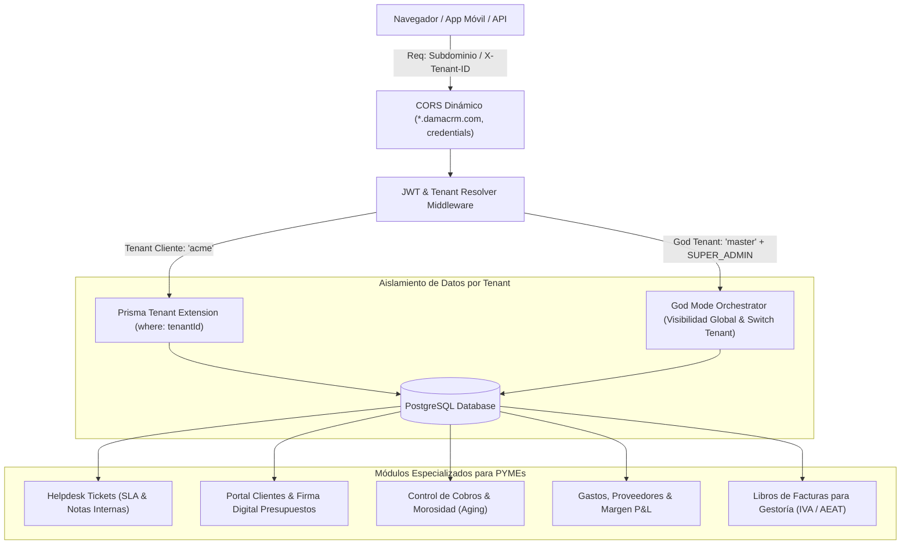

# 🏢 Arquitectura Multi-Tenant, God Mode, Sistema de Tickets y Suite PYME

> Documento técnico y funcional de especificación para la evolución de **DAMA-CRM** a plataforma SaaS Multi-Tenant empresarial orientada a PYMEs.

---

## 1. Visión y Objetivos

Evolucionar DAMA-CRM hacia un modelo **Multi-Tenant SaaS** escalable donde múltiples empresas clientes puedan operar de forma 100% aislada e independiente en la misma infraestructura, gobernadas por un **Tenant Maestro (God Tenant)** central para la administración global, integrando un **Sistema de Tickets Helpdesk** omnicanal con SLA y una **Suite de Alto Valor para PYMEs**.

---

## 2. Aislamiento Multi-Tenant y Seguridad

### 2.1 Modelo de Datos en Prisma
Se incorpora la entidad `Tenant` como partición de datos:
- `id`: UUID.
- `slug`: Identificador único legible (`master`, `acme`, `innovatech`).
- `name`: Razón social de la empresa cliente.
- `domain`: Subdominio o dominio propio (`crm.acme.com`).
- `isGodTenant`: Booleano (`true` únicamente para el tenant maestro).
- `status`: `ACTIVE`, `SUSPENDED`, `TRIAL`.
- `plan`: `STARTER`, `PRO`, `ENTERPRISE`.
- `maxUsers`: Cuota máxima de usuarios asignables.
- `branding` / `settings`: Configuración gráfica y módulos activos por tenant.

### 2.2 Estrategia de Aislamiento en el ORM (Prisma Extended Client)
- **Filtro Automático:** Todas las operaciones de lectura (`findMany`, `findFirst`, `findUnique`, `count`) inyectan forzosamente `where: { tenantId }`.
- **Inyección en Mutaciones:** Las creaciones (`create`, `createMany`, `update`) asignan de forma automática `data: { tenantId }`.
- **Prevención de Fugas de Información:** Ningún usuario o petición puede acceder a entidades cuyo `tenantId` no coincida con el de su contexto de sesión validado.

### 2.3 Resolución del Tenant
Resolución en cascada de 3 niveles:
1. **Subdominio HTTP:** `https://empresa.damacrm.com` o `empresa.localhost:5173`.
2. **Cabecera HTTP Explícita:** `X-Tenant-ID` o `X-Tenant-Slug` (para apps móviles, integraciones y webhooks).
3. **Claim en JWT:** Token de autenticación firmado con `tenantId`.

---

## 3. El Tenant de God (God Mode / SuperAdmin)

El **Tenant de God** (`slug: 'master'`, `isGodTenant: true`) es el centro de control para los administradores de la plataforma DAMA:
- **Supervisión Global:** Listado unificado de todos los tenants activos, total de usuarios, volumen de facturación y almacenamiento.
- **Aprovisionamiento Instantáneo:** Alta de nuevos tenants con generación automática de su usuario administrador y roles preconfigurados.
- **Suspensión / Reactivación:** Bloqueo o desbloqueo inmediato de acceso para empresas en mora o mantenimiento.
- **Función "Switch Tenant" (Impersonation):** Permite al SuperAdmin conmutar temporalmente la vista para acceder a cualquier tenant en modo soporte técnico de nivel 3 con registro en el `AuditLog`.

---

## 4. Blindaje y Configuración Dinámica de CORS

- **Resolución Dinámica de Origen:** Sustitución de `origin: '*'` por un resolver que valida subdominios autorizados (`*.damacrm.com`, subdominios locales y dominios explícitos configurados en variables de entorno).
- **Soporte de Credenciales:** `credentials: true` para envío seguro de cookies y cabeceras de autorización.
- **Cabeceras Multi-Tenant Autorizadas:** `X-Tenant-ID`, `X-Tenant-Slug`, `X-Switch-Tenant-ID`, `Content-Type`, `Authorization`, `x-unopim-secret`.
- **Cabeceras Expuestas:** `Content-Disposition` (descarga segura de facturas PDF) y `X-Tenant-ID`.
- **Caché de Preflight:** `maxAge: 86400` (24 horas) para eliminar peticiones OPTIONS redundantes.

---

## 5. Módulo Integral de Tickets de Soporte (Helpdesk)

- **Entidades:**
  - `Ticket`: Número correlativo (`TCK-YYYY-SEQ`), título, descripción, estado (`OPEN`, `IN_PROGRESS`, `WAITING_CUSTOMER`, `RESOLVED`, `CLOSED`), prioridad (`LOW`, `MEDIUM`, `HIGH`, `URGENT`), categoría, canal (`PORTAL`, `EMAIL`, `WHATSAPP`, `PHONE`, `INTERNAL`), cliente, contacto y agente asignado.
  - `TicketMessage`: Remitente (`AGENT`, `CUSTOMER`, `SYSTEM`), cuerpo formateado, archivos adjuntos y flag `isInternal`.
- **Notas Internas Confidenciales:** Mensajes privados entre miembros del equipo técnico (resaltados visualmente en amarillo), invisibles para el cliente.
- **Gestión de Acuerdos de Nivel de Servicio (SLA):** Cálculo automático de plazos de respuesta y resolución según la prioridad, con alertas visuales de tiempo restante.
- **Vistas Duales:** Listado en Tabla interactiva con filtros avanzados y Tablero Kanban ágil por estados.
- **Tiempo Real:** Notificaciones instantáneas mediante WebSocket al crearse un ticket o recibirse una respuesta.

---

## 6. Suite de Funcionalidades de Alto Valor para PYMEs

### 6.1 Portal B2B de Autoservicio y Firma Digital de Presupuestos
- Enlace público tokenizado para que el cliente visualice su presupuesto en PDF.
- **Firma Digital Online:** Lienzo Canvas HTML5 para firmar con el dedo o ratón y aceptar términos legalmente.
- **Aceptación y Facturación:** Paso automático a estado `ACCEPTED` y generación instantánea de la factura en borrador.
- Historial de facturas y presupuestos descargables en formato ISO 216 / 8601 / 4217.

### 6.2 Control de Cobros, Morosidad y Recobro (Dunning)
- **Aging Report (Antigüedad de Deuda):** Clasificación en tramos (En plazo, Vencidas 1-30d, 31-60d, +60d).
- **Abonos Parciales:** Registro de pagos fraccionados con desglose hasta la cancelación total de la factura.
- **Avisos de Vencimiento:** Envío de recordatorios automáticos por email/WhatsApp con datos bancarios (IBAN).

### 6.3 Gastos, Proveedores y Margen Operativo P&L
- Registro de compras de la empresa con proveedor, NIF, categoría, base imponible, tipo de IVA y comprobante.
- Comparativa en tiempo real de **Ingresos Facturados - Gastos = Margen Operativo**.

### 6.4 Libro de Facturas para Gestoría / Asesoría Fiscal
- Exportación trimestral en 1 clic de los libros oficiales exigidos por la Agencia Tributaria (AEAT):
  - *Libro Registro de Facturas Expedidas*
  - *Libro Registro de Facturas Recibidas*
- Resumen automático de bases y cuotas para la liquidación del Modelo 303 (IVA) y retenciones.

### 6.5 Partes de Trabajo y Horas Facturables (SAT / Consultoría)
- Registro de horas invertidas en tareas, incidencias o proyectos.
- Volcado en un clic de horas acumuladas hacia conceptos de una nueva factura.

---

## 7. Fases de Despliegue e Implementación

1. **Fase 1: Esquema de Base de Datos y Migración de Aislamiento:** Creación del modelo `Tenant` en Prisma, adición de claves `tenantId` y script de migración que asocia datos históricos al tenant `master`.
2. **Fase 2: Motor de Aislamiento y CORS:** Middleware de resolución de tenant, extensión de Prisma y endurecimiento de CORS.
3. **Fase 3: God Tenant & Panel SuperAdmin:** Endpoints y panel ejecutivo de gestión de tenants y switch tenant.
4. **Fase 4: Helpdesk Ticketing Backend & Frontend:** Modelos de tickets, API REST, WebSocket y vistas de tablero/chat.
5. **Fase 5: Módulos PYME:** Firma online de presupuestos, portal de autoservicio, registro de gastos y exportaciones fiscales.
6. **Fase 6: Testing & Validación:** Batería automatizada de pruebas de aislamiento inter-tenant, SLA de tickets y CORS.
